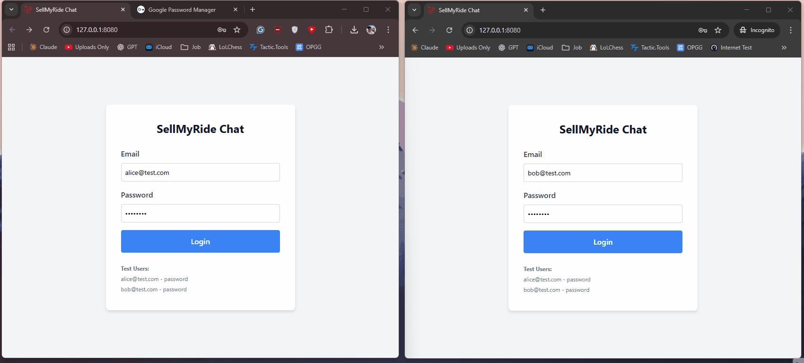

# SellMyRide Chat Application

A real-time private chat application built with Laravel 12 and React, featuring instant messaging via Pusher broadcasting.



## Tech Stack

**Backend:**

-   Laravel 12 (PHP 8.2+)
-   SQLite Database
-   Laravel Sanctum (API Authentication)
-   Pusher (WebSocket Broadcasting)

**Frontend:**

-   React 18
-   Vite
-   Axios
-   Laravel Echo + Pusher JS

## Features

-   User authentication with Laravel Sanctum
-   Real-time private messaging between users
-   Message persistence in database
-   Live message broadcasting via Pusher
-   Responsive UI
-   Multiple conversation support

## Setup Instructions

### Prerequisites

-   PHP 8.2 or higher
-   Composer
-   Node.js & NPM
-   Pusher account

### Installation

1. **Clone the repository**

```bash
   git clone https://github.com/YOUR-USERNAME/sellmyride-chat.git
   cd sellmyride-chat
```

2. **Install dependencies**

```bash
   composer install
   npm install
```

3. **Set up environment**

```bash
   cp .env.example .env
   php artisan key:generate
```

4. **Create database**

```bash
   touch database/database.sqlite
   # Windows: New-Item database/database.sqlite
```

5. **Run migrations and seed test users**

```bash
   php artisan migrate --seed
```

This creates two test users:

-   alice@test.com / password
-   bob@test.com / password

6. **Configure Pusher**
    - Sign up at [pusher.com](https://pusher.com)
    - Create a new Channels app
    - Add credentials to `.env`:

```env
     PUSHER_APP_ID=your_app_id
     PUSHER_APP_KEY=your_app_key
     PUSHER_APP_SECRET=your_app_secret
     PUSHER_APP_CLUSTER=your_cluster

     VITE_PUSHER_APP_KEY="${PUSHER_APP_KEY}"
     VITE_PUSHER_APP_CLUSTER="${PUSHER_APP_CLUSTER}"
```

7. **Start the development servers**

    You need 3 terminal windows:

    **Terminal 1 - Laravel:**

```bash
   php artisan serve --port=8080
```

**Terminal 2 - Vite:**

```bash
   npm run dev
```

**Terminal 3 - Queue Worker (optional, only if QUEUE_CONNECTION=database):**

```bash
   php artisan queue:work
```

8. **Access the application**
    - Open: http://localhost:8080
    - Login with test credentials above

### Testing Real-Time Chat

1. Open http://localhost:8080 in a regular browser window
2. Login as Alice
3. Open http://localhost:8080 in an incognito/private window
4. Login as Bob
5. Click on each other's names to start chatting
6. Messages should appear instantly in both windows

## Technical Notes

-   Uses public channels for broadcasting (can be secured with private channels)
-   SQLite for easy setup (can switch to MySQL/PostgreSQL)
-   Queue connection set to `sync` for immediate broadcasts
-   Laravel Sanctum for token-based API authentication
-   CORS configured for local development
